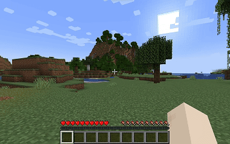

  

---

# 🪐 AetherFlow (LetterboxMod)

> A Minecraft Fabric mod that adds a cinematic letterbox effect when sneaking.

## 🧩 Features

- Smooth black bars fade in/out when sneaking (Shift).
- Bars appear behind the hotbar and other HUD elements.
- Ease-in / ease-out animation style.
- Minimal performance impact.

## 🎮 Compatibility

- **Minecraft**: 1.21.4  
- **Fabric Loader**: >= 0.14.x  
- **Java**: 21+

## 📦 Installation

1. Install [Fabric Loader](https://fabricmc.net/use/).
2. Install [Fabric API](https://modrinth.com/mod/fabric-api).
3. Download the latest release of **LetterboxMod** from [Modrinth](https://modrinth.com/) or the [Releases](https://github.com/beltrancruz/aetherflow_letterbox/releases) section.
4. Drop the `.jar` file into your `mods/` folder.
5. Launch the game!

## 🖼️ Preview

## ⚙️ Configuration

_No configuration needed. The mod activates the effect automatically when sneaking._

## 👤 Credits

Developed by **@beltrancruz**  
Special thanks to [FabricMC](https://fabricmc.net/) and the Minecraft modding community.

## 🪪 License

This project is licensed under the **MIT License**. See [`LICENSE`](./LICENSE) for more details.
